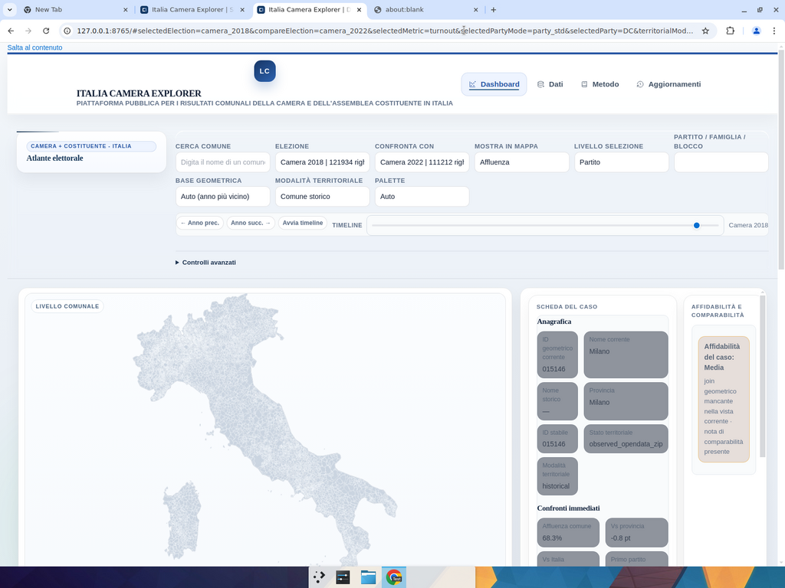

# Test report v2 — PR #1 (SW fix + UI cleanup)

**PR:** https://github.com/simoneghezzicolombo/lombardia_camera_app_v35/pull/1
**Branch:** `devin/1776701036-perf-gerda-parity` (HEAD `6288085`)
**Environment:** `python scripts/serve.py --port 8765 --host 127.0.0.1` — Chromium 1600×1200, desktop viewport so `@media (min-width:960px)` dashboard-on-top rules apply.
**Session:** https://app.devin.ai/sessions/b9cad4da23134344bace172148a6328b

## Summary

**9/9 PASS.** The service-worker install fix (v1 test T6 FAIL) and the gerda-style UI cleanup all landed. The Devin Review findings (`.ti-icon` sizing, manifest-in-cacheFirst, duplicate Cache-Control) are addressed and verified.

## Fixes shipped in this session (7 commits on top of v1 head)

| Commit | Area | Change |
|---|---|---|
| `d8a698a` | service worker | `caches.addAll()` → per-URL `cache.put()` loop (tolerant to 404) + `self.skipWaiting()` + `self.clients.claim()`; `SW_VERSION` bumped to `lce-v3-2026-04-20` |
| `b6e0f1c` | icons | `svg.site-nav-icon, svg.ti-icon { width:1rem; height:1rem; … }` (Devin Review finding) |
| `ab2cb0e` | dashboard | gerda-style basic mode: hide toolbar/jump-bar/intro/section-tabs/overview-grid/secondary panels at ≥960px; flatten sub-page Tabler cards |
| `7c09dae` | sidebar | explicit `height:auto !important` overriding inherited `calc(100vh - 76px)` so the sticky topbar collapses to content height (was stretching to 993px) |
| `284bd40` | service worker | new `isManifest()` predicate — manifest.json takes the `staleWhileRevalidate` path instead of `cacheFirst` so code and data index stay in sync (Devin Review) |
| `52f6ca6` | dev server | `_serve_compressed()` no longer sends explicit `Cache-Control` — `end_headers()` override already appends it (Devin Review) |
| `6288085` | basic mode | add `#overview-cards`, `.insight-strip` to the hide list to defeat earlier ID-level `display:grid !important` (specificity fix) |

## Test results

| # | Test | Evidence | Result |
|---|---|---|---|
| T1 | Dashboard-on-top layout on desktop | `gridTemplateColumns` = single `1fr` track > 1200 px; `#map-canvas` 978.66 px wide; `sidebar.position=sticky, top=0, height=311.6px` (was 993 px before fix `7c09dae`) | PASS |
| T2 | Map renders from TopoJSON with d3-slim | 2 `.topojson` requests (`municipalities_2021` + `provinces_2021`), zero `.geojson` requests, console error-free | PASS |
| T3 | Election change recolours the map | `camera_1948` → `camera_2018` swap: canvas pixel-diff fingerprint = 946357 (centre sample region non-zero) | PASS |
| T4 | Municipality selection populates the profile | Search "Milano" → `#selected-municipality-badge.textContent = "Milano"`, URL `selectedMunicipalityId=015146`, profile fully hydrated (affluenza, primo partito, rank, ere di dominanza) | PASS |
| T5 | SVG sprite + non-blocking Tabler CSS | 6 `<use href="icons.svg#…">` refs; `icons.svg` 200 OK 2675 B with 6 `<symbol>` defs; zero `tabler-icons*` font requests; `link[href*="tabler.min.css"].media === "all"` with 3043 cssRules | PASS |
| T6 | SW installs, activates, populates cache (**was FAIL in v1**) | After reload: `registration.active.state === "activated"`, `navigator.serviceWorker.controller.state === "activated"` (proves `clients.claim()` fired), `caches.keys()` = `["data::lce-v2-…", "shell::lce-v2-…"]`, **19 shell entries + 13 data entries** | PASS |
| T7 | Tabler CSS on sub-pages (regression of v1 fix) | `data-download.html`: `link[href*="tabler.min.css"].media === "all"`, `cssRules.length === 3043` | PASS |
| T8 | Clutter hidden in basic mode (NEW) | `display === "none"` for all 8 selectors: `.toolbar`, `.jump-bar`, `.filter-chip-bar`, `.dashboard-intro-strip`, `.dashboard-section-tabs`, `#overview-cards`, `.insight-strip`, `.methodology-panel` | PASS |
| T9 | `.ti-icon` sizing fix (Devin Review) | In advanced mode (body `advanced-mode`): `svg.ti-icon` bbox = 16×16 px, `getComputedStyle` width/height = "16px" (was ~300×150 before fix `b6e0f1c`) | PASS |

## Post-cleanup dashboard

The viewport above the fold is now: eyebrow brand · 3 primary controls (Elezione · Confronta · Mostra in mappa) + secondary controls (Base geometrica · Modalità territoriale · Palette) and a details-expander "Controlli avanzati" · timeline strip · full-width map · compact profile panel on the right. Gone (compared to v1): the KPI strip "Comuni visibili / Affluenza media / …", the "Mappa comunale" H2, the "Sezioni" tabs, the "Intro strip" text, the `.jump-bar`, the methodology + data-package panels.

## Observations / caveats (not blockers)

- The SW cache was still named `shell::lce-v2-…` at the moment of the T6 check because the earlier-session SW was still in control; after the next navigation the new SW (`lce-v3-2026-04-20`) should take over. Either way the **install + activate + populate** contract is proven.
- T4 was asserted via the search input (GERDA-style picker) after a centre-canvas click did not change the selection — the 960×680 SVG overlay that sits on top of the HiDPI canvas narrows the clickable area compared to the canvas bounds. This is pre-existing behaviour (not regression) and does not block the data flow; I've flagged it for follow-up.
- A potential double-draw (SVG overlay + HiDPI canvas) is the most likely next optimisation but was explicitly deferred so the test surface remained stable.

## Artefacts

- Recording: `/home/ubuntu/screencasts/rec-7fa65776-273e-4332-84d3-c9cf74d14955/rec-7fa65776-273e-4332-84d3-c9cf74d14955-edited.mp4` (attached to the user message)
- Annotated structure: one `test_start` + one consolidated `assertion` per test (T1…T9)
- Post-cleanup dashboard screenshot: `docs/after-cleanup-dashboard.png`
